# Weather application

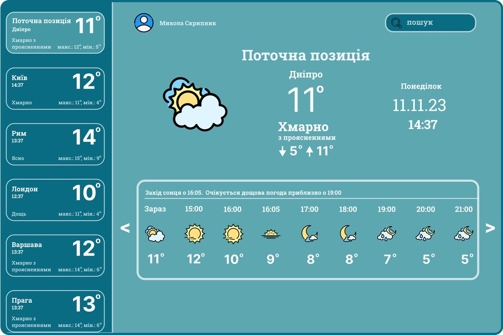

Цей проект розроблено з метою ознайомлення із роботою API, принципом отримання даних від віддаленого серверу, вмінням їх обробляти, структурувати та застосовувати у своємо проєкті. А саме застосовувалось API такого веб-ресурсу як [OpenWeatherMap](https://openweathermap.org). Проєкт допоможе розібратися із роботою файлів JSON, як правильно отримувати та зберігати дані у файлах з типом .json. Та познайомити користувача з інтерфейсом застосунку розробленим за допомогою пакету [CustomTkinter](https://customtkinter.tomschimansky.com)

### Зміст репозиторія:

1. [Основні модулі проєкту](#all-modules)
2. [Розгортання проєкту](#download-project)
3. [Створення віртуального оточення проєкту](#create-venv)
4. [Завантаження модулів до віртуального оточення](#download-modules-venv)
5. [Старт проєкту](#start-project)
6. [Основні механіки проєкту](#all-mechanics)
7. [Висновок по проєкту](#result) 
___
<h4 id= 'all-modules'>Основні модулі проєкту:</h4>
All modules

- [customtkinter](https://customtkinter.tomschimansky.com/)
- [json](https://docs.python.org/3/library/json.html)
- [requests](https://pypi.org/project/requests/)
- [pillow](https://pypi.org/project/pillow/)
- [os](https://docs.python.org/3/library/os.html)
- [colorama](https://pypi.org/project/colorama/)
- [datetime](https://docs.python.org/3/library/datetime.html)
___
<h4 id= 'download-project'>Розгортання проєкту:</h4>
Download project

1. Склонувати з Git Hub репозиторію
    - Спершу треба зайти на гіт хаб і натиснути на зелену кнопку "code" і скопіювати там посилання
    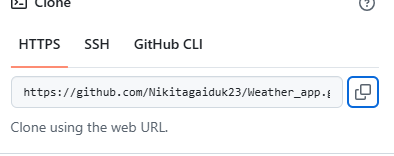
    - Потім скопійоване посилання вставити у термінал в Vs code
    
    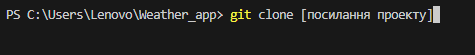

2. Завантажити за допомогою zip-архіву
    - Спочатку треба зробити теж саме як і на минулому варіанті АЛЕ, замість того щоб копіювати посилання, треба подивитися у низ та побачити кнопку Download Zip
    
    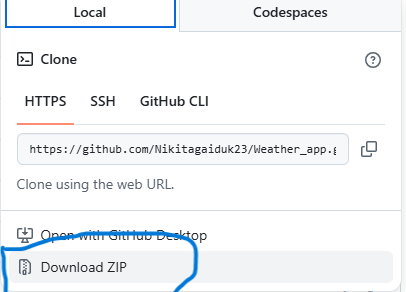

    - Після того як ви завантажете проект, треба за допомогою [winrar](https://www.win-rar.com/start.html?&L=4) розархірувати проект та відкрити папку з ним у Vs code
<h4 id= 'create-venv'>Створення віртуального оточення проєкту:</h4>
Сreate venv

1. Windows
    - щоб створити віртуальне оточення на windows треба відкрити термінал у Vs Code та вписати ці команди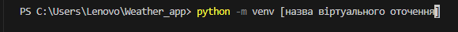
    
    - 

2. Mac OS або Linux
    - Схоже як і на віндовс але відрізняется, замість python треба вписати python3

    - 
    
    - 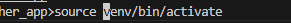
___
<h4 id= 'download-modules-venv'>Завантаження модулів до віртуального оточення:</h4>
Download modules venv

1. Окремими модулями
    - модулі які треба завантажити
        customtkinter,
        darkdetect,
        packaging,
        requests,
        pillow,
        Як це робится? За допомогою команди pip install
      - 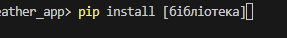

2. За допомогою файлу requirements.txt
    - У терміналі треба вписати теж pip install але після install не назва бібліотеки а -r requerements.txt
    - 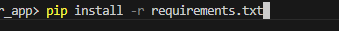
<h4 id= 'start-project'>Старт проєкту:</h4>
Start project

1. За допомогою терміналу
   - Щоб запустити проєкт за допомогою терміналу треба вписати python main.py
   - 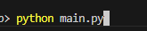

2. За допомогою вс коду
    - Щоб запустити проєкт таким методом треба перейти у файл main.py Та натиснути на кнопку у правому верхньому куті у вс код
    - 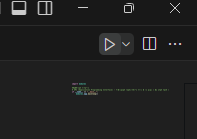

<h4 id= 'all-mechanics'>Механіки проєкту:</h4>
Аll mechanics

1. Механіки:
    - Ви маєте змогу змінювати міста за допомогою файлу static/config.json
      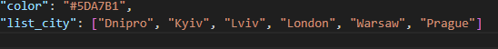
    - Також ви можете дивитися розклад на кілька діб уперед
      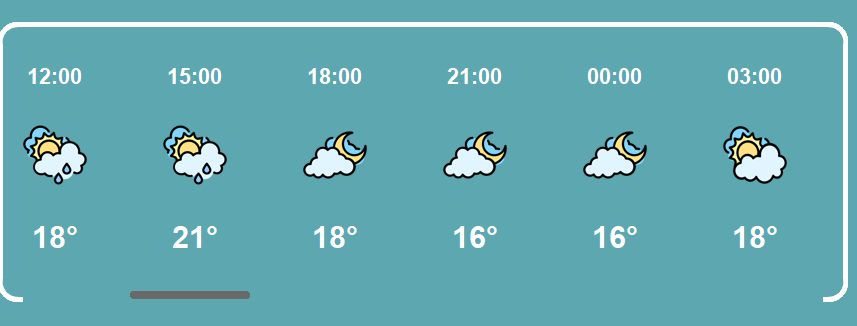

<h4 id= 'result'>Висновок:</h4>
Result

- Висновок такий:
    По кінцю цього проєкту я начився працювати з сustom tkinter, api та pillow. За допомогою цього проєкту я навчився користуватися json та Git. Також цей проєкт показав мені на що здатен пайтон, а саме: отримування api ключа, читання та працювання з json файлами. От же цей проєкт був не тільки зроблений для користування, а також для того щоб навчитись користуватися різними бібліотеками та просто був цікавим досвідом.